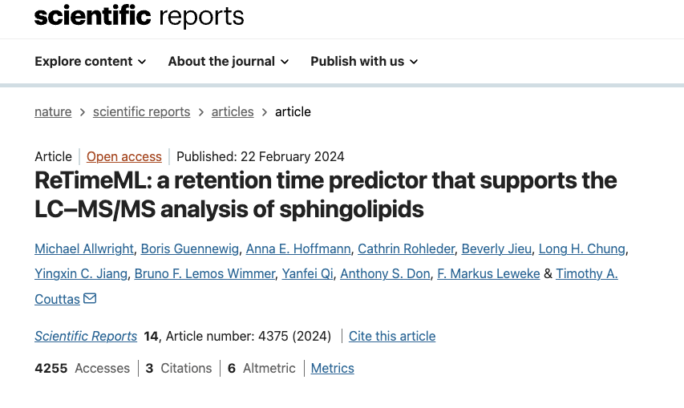

# 🧬 ReTimeML: Predicting Lipid Retention Times (Collaborative Project)

This repository highlights my contributions to a published study applying machine learning to predict sphingolipid retention times in LC–MS/MS analysis. 

The project demonstrates how ML can accelerate lipidomics workflows by reducing experimental trial-and-error, improving reproducibility, and supporting novel discoveries.

🔗 [Read the full publication in *Nature Scientific Reports*](https://www.nature.com/articles/s41598-024-53860-0)

To illustrate the machine learning workflow described in our publication, this repository includes a **demonstration notebook** built on a synthetic dataset.  

The notebook shows:
- Feature preparation (m/z ratios, ion types, lipid classes)  
- Regression modelling using Random Forest (scikit-learn)  
- Model evaluation with RMSE and R²  
- Visualisation of predicted vs actual retention times  

🔗 [Open the demo notebook](notebooks/demo_feature_engineering.ipynb)

> ⚠️ Note: The dataset used here is **synthetic and simplified**. It is a mock data. It is designed to demonstrate the concepts and pipeline rather than reproduce the original research results. The real sphingolipid datasets are not publicly available.

The following figures are adapted from the publication  

> Figure is adopted from the open-access article under the Creative Commons Attribution 4.0 International License.
